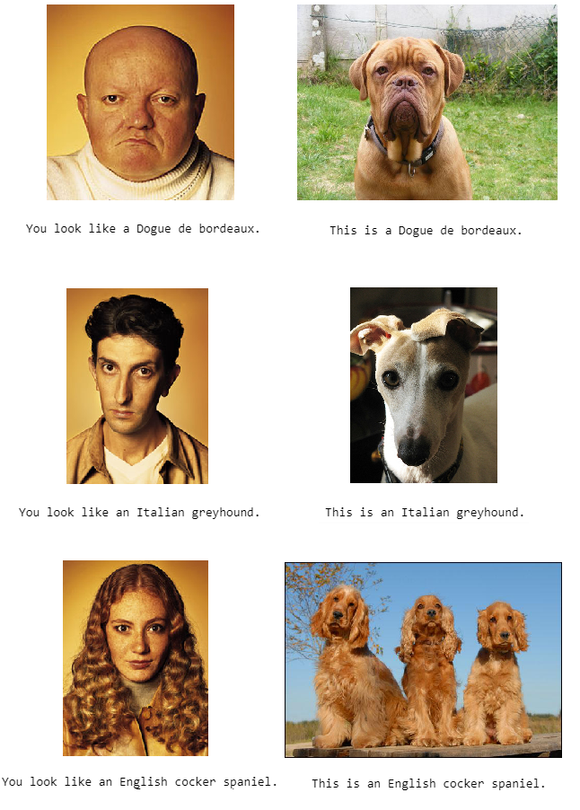

# Doggelgänger Finder 🐶 with Transfer Learning (PyTorch)

* Given a dog image, the model predicts the dog's breed.
* Given a human face image, the model predicts a dog breed that resembles the face the most. 

## Results

The following shows example predictions of the model:

## Datasets
* Download [dog images dataset](https://s3-us-west-1.amazonaws.com/udacity-aind/dog-project/dogImages.zip).  Unzip the folder and place it in `dog_images/` directory. 
* Download [human face images dataset](https://s3-us-west-1.amazonaws.com/udacity-aind/dog-project/lfw.zip).  Unzip the folder and place it in `lfw/` directory. 

## List of Hyperparameters used:

* Type of Pre-trained Model for Transfer Learning: **ResNet18**
* Batch Size: **20**
* Learning Rate: **0.0003 (first 6 epochs), 0.0001 (next 8 epochs), 0.00007 (last 16 epochs)**
* Number of Epochs: **30**

## Repository 

This repository contains:
* **dogbreed_predictor.py** : Complete code for transforming and batching training images, training the model, and printing out the predictions

## Sources

* https://github.com/udacity/deep-learning-v2-pytorch
